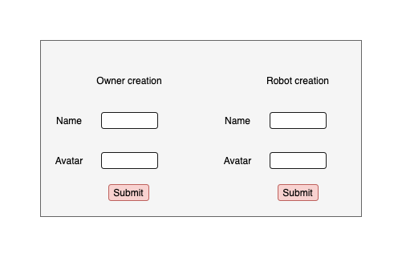
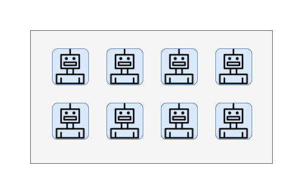
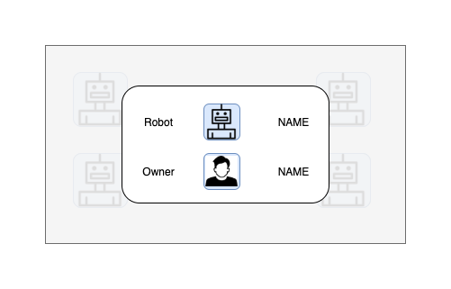

# Technical test Cutii

## Your mission

Write an app that allows to :
- create an owner and a robot
- display robots and theirs owners

We have setup [react-router](https://reactrouter.com/) to display two pages in app :
- `/form` that must display a form to create an owner and a robot
- `/gallery` that must display robots and owners

Feel free to add buttons to navigate between pages (not mandatory).

### Screens

- Form




- Gallery



Then when we click on one robot, it must display a modal with informations ... ➡️

- Informations




You must use this technical stack :
- ReactJS
- Redux (https://redux.js.org/) to manage global state
- styled-components (https://styled-components.com/)
- redux-loop (https://redux-loop.js.org/) to manage side effects (💡 like a fetch)

⚠️ You should not use local state in your components. For example to open or close a modal, use an redux action.

Your app must be in `app` folder. To setup your project, run the following commands :
```
npm i
npm run dev
```
Your app will be run on port 3000. We use ViteJS instead of Webpack.

To start the server, go in `server` folder and follow this steps :
- run `npm i` to install dependencies
- go to https://www.elephantsql.com/ to create a free Postgresql database
- update `.env` file with the postgres uri to your database
- run `npm start` . Your server should start on port 3002.

## API

API allows to get two types of ressources : `Robots` and `Owners`. There are some business rules :

- An owner can have many robots.
- A robot has one owner.
- Name must be unique for owners.
- Name must be unique for robots.

### Owners

- Create an owner

```
POST /owners

Body : {
  name: string;
  avatarUrl: string;
}
```

- Get all owners with theirs robots associated.
```
GET /owners
```


- Get an owner by his name
```
GET /owners/:name
```

### Robots


- Get all robots.
```
GET /robots
```

- Get an robot by his name
```
GET /robots/:name
```

- Create a robot
```
POST /robots

Body : {
  name: string;
  avatarUrl: string;
  ownerId: string;
}
```

